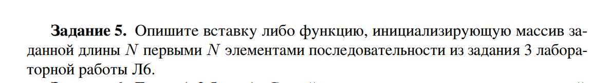

# Лабораторная работа 7
## Пономарев Александр, Абдурашитов Рустам ПМ-31
## Вариант 1

# Задание 1:


## Программа на языке с++:
````cpp
#include <iostream>
#include <array>

int main() {
    const std::size_t size = 10;
    std::array<int, size> a{0, 1, 2, 3, 4, 5, 6, 7, 8, 9};

    std::cout << "Size of element: " << sizeof(a[0]) << std::endl;
    
    for (std::size_t i = 0; i < size - 1; ++i) {
        std::cout << "Differns between addres of elements "
                  << i+1 << ", " << i
                  << " = " << &a[i+1] << " - "  << &a[i]
                  << " = " << (&a[i+1] - &a[i]) * sizeof(a[0]) << std::endl;
    }

    std::cout << "Size of array: " << sizeof(a) << std::endl;
    std::cout << "Addres of element = addres of begin + n * sizeof(element)"
              << std::endl;

    return 0;
}
````
## Результат вызова:


# Задение 2:

## Программа на языке с++:
````cpp
#include <iostream> 
#include <ctime> 
#include <stdio.h> 
#include <stdlib.h> 
#include <time.h> 

int main() { 
    srand(time(0)); 
    int N = 0; 
    std::cout  <<  "Enter array size: "; 
    std::cin >> N;
    int* array = new int [N]; 
    std::cout << "Size of one element:" << sizeof(array[0]) << std::endl; 
    std::cout << "Random int array:" << std::endl; 
    for(size_t i=0 ; i < N; i++) { 
        array[i] = rand() % N; 
        std::cout << " " << array[i]; 
    } 
    std::cout << "\n"; 
    int min = 0; 
    asm (R"(
        push %%eax
        push %%ebx
        push %%ecx
        movl $1, %%eax
        movl %[array], %%ebx
        movl (%%ebx), %%ebx
        Start:
        cmpl %[N], %%eax
        je Exit
        movl %[array], %%ecx
        leal (%%ecx, %%eax, 4), %%ecx
        movl (%%ecx),%%ecx
        cmpl %%ebx, %%ecx
        jnbe lable
        movl %%ecx, %%ebx
        lable:
        incl %%eax
        jmp Start
        Exit:
        movl %%ebx, %[min]
        pop %%ecx
        pop %%ebx
        pop %%eax
    )"
    : [min]"+m" (min) 
    : [array]"m" (array), [N]"m"(N) 
    : "cc" 
    ); 
    std::cout << "Minimum:" << min << std::endl;
    delete [] array; 
    return 0; 
}
````
## Результат вызова:


# Задание 3:


## Программа на языке с++:
````cpp
#include <iostream>
#include <array>

struct pair {
    int first;
    double second;
};

int main() {
    const std::size_t size = 5;
    std::array<pair, size> b;
    for (std::size_t i = 0; i < size; ++i) {
        b[i].first = static_cast<int>(i);
        b[i].second = static_cast<double>(i/10) + static_cast<double>(i);
    }

    std::cout << "Size of pair: " << sizeof(pair) << std::endl;
    std::cout << "Size of pair.first: " << sizeof(b[0].first) << std::endl;
    std::cout << "Size of pair.second: " << sizeof(b[0].second) << std::endl;
    std::cout << "Difference between neighborhood"
        << " = " << &b[1] << " - "  << &b[0]
        << " = " << (&b[1] - &b[0]) * sizeof(b[0]) << std::endl; 
    
    std::cout << "Size of array: " << sizeof(b) << std::endl;
    std::cout << "Addres of el.first = beg + n * sizeof(el)" << std::endl;
    std::cout << "Addres of el.second = beg + n * sizeof(el) + sizeof(el.key)" 
              << std::endl;

    return 0;
}
````

## Результат вызова:


# Задание 4:


## Программа на языке с++:
````cpp
#include <iostream>

struct KeyValuePair {
    int key;
    int value;
};

int main() {
    srand(100);
    int N = 15;
    struct KeyValuePair * array = new struct KeyValuePair[N];

    for (int i = 0 ; i < N ; i++) {
        array[i].key=rand()%5;
        array[i].value=rand()%(100)+1;
        printf("Key = %d, Value = %d\n",array[i].key,array[i].value);
    }

    int key = 4;
    int min = 0;
    int max = 1000;

    asm (R"(
        movl $1, %%eax
        movl %[max], %%edx
        movl $0, %%eax
        Start:
        cmpl %[N], %%eax
        je Exit
        movl %[array], %%ecx
        leal (%%ecx, %%eax, 8), %%ecx
        movl (%%ecx),%%ecx
        cmpl %[key],%%ecx
        jne isOurKey
        movl %[array], %%ecx
        leal 4(%%ecx, %%eax, 8), %%ecx
        movl (%%ecx),%%ecx
        cmpl %%edx,%%ecx
        ja isOurKey
        movl %%ecx,%%edx
        isOurKey: 
        incl %%eax
        jmp Start
        Exit:
        movl %%edx, %[min]
    )"
        : [min]"=m" (min)
        : [array]"rm" (array), [N]"m"(N),[key]"m"(key),[max]"m"(max)
        : "cc","%eax","%edx","%ecx"
    );

    if (min == max) {
        std::cout << "No such elements:" << key << std::endl;
    } else {
        std::cout << "MIN (with key "<< key << ") = " << min << std::endl;
    }

    delete [] array;
    return 0;
}
````

## Резальтут вызова:


# Задание 5:


## Программа на языке с++:
````cpp
#include <iostream>

int main() {
    int N ,ai,x;
    int an0 = 1, an1=1;
    std:: cout << "Enter N: ";
    std::cin >> N;
    
    int * array = new int [N];

    for (int i = 0; i < N; ++i) {
        array[i] = 0;
    }

    asm(R"(
        movl $0, %%ebx
        begin: 
        cmpl %[N], %%ebx
        jz end
        movl %[an0],%%eax
        movl %[array], %%ecx
        movl %%eax,(%%ecx, %%ebx, 4)
        movl %[an1],%%edx
        addl %%edx,%%eax
        movl %[an0],%%edx
        movl %%eax, %[an0]
        movl %%edx, %[an1]
        incl %%ebx
        jmp begin
        end: 
    )"
        :[ai]"+r"(ai),[x]"+r"(x),[N]"+r"(N)
        :[array]"m"(array),[an0]"rm"(an0),[an1]"rm"(an1)
        :"cc","%eax","%ecx","%ebx","memory"
    );
    
    for (int i = 0; i < N; ++i) {
        std::cout << " " << array[i];
    }

    std::cout << std::endl;
    return 0;
}

````

## Результат вызова:

